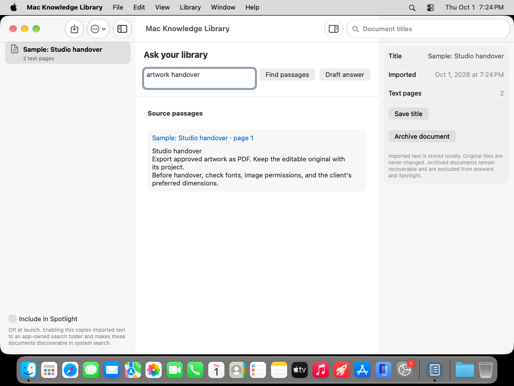

# Mac Knowledge Library

A native macOS 27 library for imported text PDFs, plain text, and Markdown. Find supporting passages, inspect their page references, and review drafts from Apple's on-device language model.




[](https://github.com/DawoodAamir/Mac-Knowledge-Library/actions/workflows/ci.yml)

## Workflows

- Import selected documents without changing the originals. Scanned PDFs without selectable text are rejected with an explanation.
- Search matching passages using deterministic word overlap. Source titles, page numbers, and excerpts are visible alongside the draft.
- Stream a cancellable on-device answer. Changing the question or a source invalidates the request. Review every generated claim against the actual document.
- Rename and archive documents. Archived text remains recoverable and is excluded from answers.
- Optionally include imported text in system Spotlight search. The OS 27 `SpotlightSearchTool` is scoped to the app's imported text copies, rather than the user's other files.

## Run

Open `Mac Knowledge Library.xcodeproj` in Xcode 27 and run on macOS 27. Bundle ID: `com.dd.macknowledgelibrary`. No signing team, API keys, third-party packages, or account is needed. Choose **Library options → Load sample document**, enter “artwork handover”, and find passages.

Drafting requires supported Apple Intelligence hardware/settings and a ready on-device `SystemLanguageModel`. Search and document reading work without it. There is no cloud or third-party model fallback.

Spotlight is **off at launch**. Enabling it indexes imported text and writes app-owned search copies; imported documents become discoverable in system search. Disabling it removes this app's index entries and search copies. Index updates may take time. Spotlight tool results depend on the system's search availability; deterministic passage retrieval remains the primary source list.

## Design and engineering

The workspace uses native split navigation, a source inspector, system typography, standard toolbar controls, and semantic colours, following [Apple's Human Interface Guidelines](https://developer.apple.com/design/). An original book icon is generated by `Scripts/GenerateIcon.swift`.

Swift 6 strict concurrency is enabled. An actor owns versioned JSON storage, atomic writes, revision checks, and app-owned search files. Bounded PDF/text import runs off the main actor. The observable UI owns cancellable model tasks and rejects stale output. OS 27 dynamic profiles carry instructions and the optional scoped Spotlight tool.

Files are limited to 20 MB, 500 PDF pages, and two million text characters; a library holds up to 100 documents/30 MB encoded data. Visible page previews are limited to 20,000 characters, while search includes the full text. Excerpts bound model context. Unsupported or corrupt libraries are preserved rather than reset.

`Sources/Core` contains storage, import, and retrieval; `Sources/App` contains native views and Apple model/Spotlight integration. `Tests/Core` covers retrieval references, archive filtering, persistence, stale edits, imports, and corrupt-file preservation. `Tests/UI` covers a sample search and persisted archive behavior.

## Verification

```sh
swift test
swift test -c release
bash Scripts/test-ui.sh
```

See [verification notes](Docs/Verification.md) for actual runs and remaining device checks. Generated citations are model output; the app's matching source list is inspectable evidence, not proof that every sentence is supported. This example does not perform OCR, semantic vector search, external syncing, or automatic source verification.

Read [PRIVACY.md](PRIVACY.md), [CONTRIBUTING.md](CONTRIBUTING.md), and the [MIT license](LICENSE). Apple references: [Core Spotlight](https://developer.apple.com/documentation/corespotlight), [Spotlight tools in OS 27](https://developer.apple.com/videos/play/wwdc2026/246/), [Foundation Models](https://developer.apple.com/documentation/foundationmodels).
